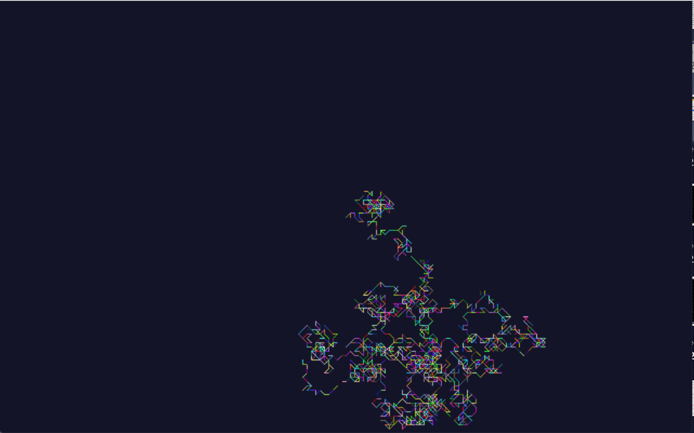

# Random Walk simulation

This is a kata.

A quick stochastic walk simulation written in Python with PyGame.

The simulation starts at an origin point and it draws a new line going in a random direction,
The end of the new line becomes the new origin point and it draws another new line going in another random direction.
This process repeats until the program is closed.

1. It can only ever go North, East, South or West.
2. Every line has the same length of 5 pixels.
3. It can never go in the same direction twice in a row.
4. It can never go in a direction that would take it off screen.
5. Each line is drawn with a random colour.



## Run

```
git clone https://github.com:spacekitcat/pygame-random-walk.git
cd pygame-random-walk
pip3 install -r requirements
python3 main.py
```
